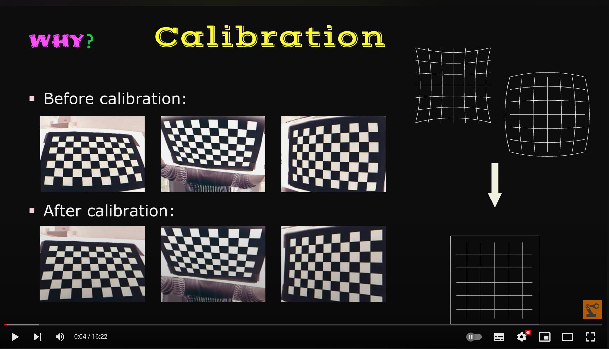

# Code in Funny! Camera calibration in C# vs Python, Word by word comparison, Explain the parameters in detail

 
 

https://www.youtube.com/watch?v=ZZ5M7Q5ZWX4&feature=youtu.be&ab_channel=CoolooAI

 
 

| original | calibrated |
|:-----:|:-----:|
|| |
|| |
|| |
|| |
|| |
|| |

 

 

## 1, download all the files
## 2, run the c# code directly via vs2022
## 3. run the python code after install all the dependences.

 

 

## PS: 

    1. c# code use the latest opencv 4.6.0, little different from the 4.4.5.
    2. python code use two calibration method, 1: udistort()  2:remap(), you can compare the difference between the two.
    3. change the original "Calibration Target" images from you cameras and run it again.

# enjoy it